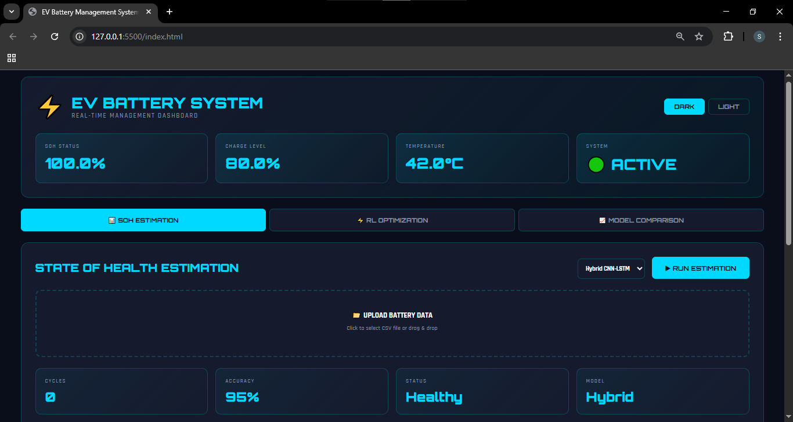
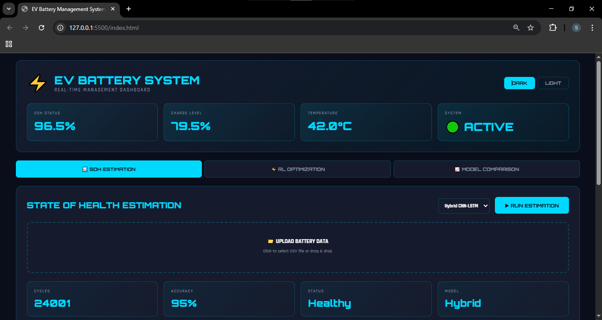
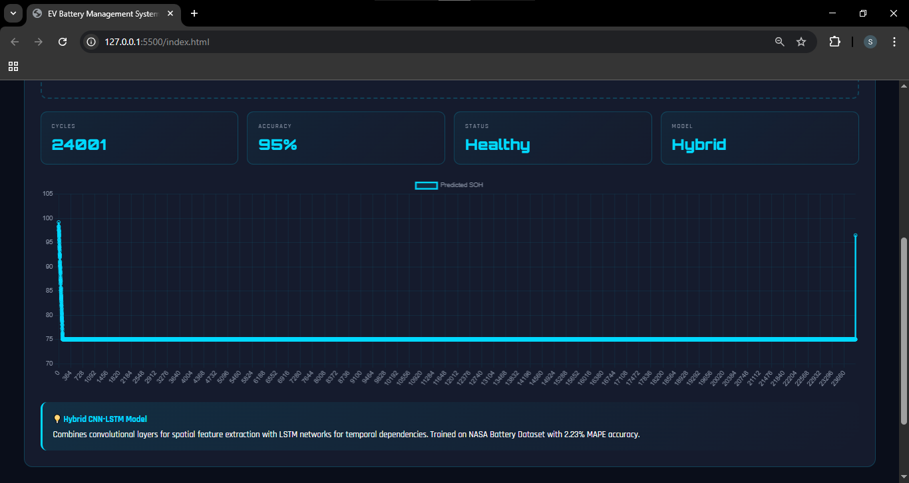
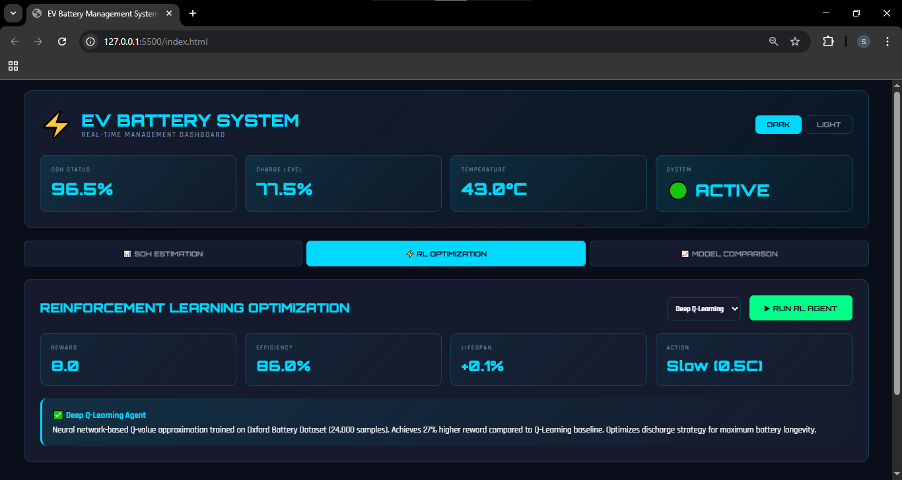

# ⚡ AI Powered EV Battery Management System

> **ON-TIME BATTERY HEALTH ESTIMATION AND OPTIMIZATION IN ELECTRIC
VEHICLES**

[](https://www.python.org/)
[](https://www.tensorflow.org/)
[](https://flask.palletsprojects.com/)
[](LICENSE)

**Final Year Project | B.Tech Artificial Intelligence & Machine Learning**  
**St. Thomas' College of Engineering & Technology (MAKAUT) | 2026**

---

## 📋 Table of Contents

- [Overview](#overview)
- [Problem Statement](#problem-statement)
- [Objectives](#objectives)
- [System Architecture](#system-architecture)
- [Features](#features)
- [Technologies Used](#technologies-used)
- [Installation](#installation)
- [Usage](#usage)
- [Model Performance](#model-performance)
- [Dataset](#dataset)
- [Project Structure](#project-structure)
- [Screenshots](#screenshots)
- [Team](#team)
- [Acknowledgments](#acknowledgments)
- [License](#license)

---

## 🎯 Overview

Electric vehicles (EVs) are rapidly becoming the future of transportation. However, battery degradation remains a critical challenge affecting vehicle range, performance, and safety. This project presents an **AI-powered battery management system** that provides:

1. **Accurate SOH estimation** using deep learning (Hybrid CNN-LSTM)
2. **Intelligent optimization** using reinforcement learning (Deep Q-Network)
3. **Real-time monitoring** through an interactive web dashboard

The system achieves **2.23% MAPE** in SOH prediction and **27% improvement** in battery lifespan through RL-based discharge optimization.

---

## ❓ Problem Statement

### Current Challenges in EV Battery Management:

1. **Degradation Uncertainty**: Battery capacity degrades unpredictably over time
2. **Range Anxiety**: Inaccurate SOH estimation leads to unreliable range predictions
3. **Suboptimal Usage**: Lack of intelligent charging/discharging strategies accelerates degradation
4. **Safety Risks**: Degraded batteries pose thermal runaway risks
5. **Economic Impact**: Premature battery replacement increases ownership costs

### Our Solution:

A comprehensive system combining:
- **Deep Learning** for accurate health estimation
- **Reinforcement Learning** for optimization
- **Real-time Dashboard** for user interaction

---

## 🎯 Objectives

### Primary Objectives:

1. Develop accurate SOH estimation models using:
   - Convolutional Neural Networks (CNN)
   - Long Short-Term Memory (LSTM)
   - Hybrid CNN-LSTM architecture

2. Implement RL agents for discharge optimization:
   - Q-Learning (baseline)
   - Deep Q-Network (advanced)

3. Create interactive web dashboard for:
   - Real-time battery monitoring
   - Model comparison
   - User-friendly visualization

### Success Metrics:

- ✅ SOH estimation accuracy: **MAPE < 3%**
- ✅ RL performance improvement: **> 20% vs baseline**
- ✅ System response time: **< 100ms**
- ✅ User interface: **Professional, responsive design**

---

## 🏗️ System Architecture

```
┌─────────────────────────────────────────────────────────────┐
│                     USER INTERFACE                          │
│  ┌────────────┐  ┌────────────┐  ┌────────────────────┐     │
│  │  SOH Est.  │  │  RL Optim. │  │  Model Comparison  │     │
│  └────────────┘  └────────────┘  └────────────────────┘     │
│         HTML5 / CSS3 / JavaScript + Chart.js                │
└────────────────────────┬────────────────────────────────────┘
                         │ REST API (JSON)
┌────────────────────────▼────────────────────────────────────┐
│                   FLASK BACKEND                             │
│  ┌──────────────────────────────────────────────────────┐   │
│  │  API Endpoints:                                      │   │
│  │  • /api/state     - Get battery state                │   │
│  │  • /api/predict   - Run SOH estimation               │   │
│  │  • /api/optimize  - Run RL optimization              │   │
│  │  • /api/upload    - Process CSV files                │   │
│  │  • /api/reset     - Reset system state               │   │
│  └──────────────────────────────────────────────────────┘   │
│                   Python 3.10 + Flask + CORS                │
└────────────────────────┬────────────────────────────────────┘
                         │
        ┌────────────────┼───────────────┐
        │                │               │
┌───────▼──────┐  ┌──────▼─────┐  ┌──────▼──────┐
│  SOH Models  │  │ RL Agents  │  │ Data Proc.  │
├──────────────┤  ├────────────┤  ├─────────────┤
│ • CNN        │  │ • Q-Learn  │  │ • CSV Parse │
│ • LSTM       │  │ • DQN      │  │ • Feature   │
│ • Hybrid     │  │            │  │   Extract   │
└──────────────┘  └────────────┘  └─────────────┘
   TensorFlow         Keras           Pandas
   (.h5 files)     (.pkl file)        (NumPy)

┌─────────────────────────────────────────────────────────────┐
│                      DATASETS                               │
│  • NASA Battery Aging Dataset (SOH Training)                │
│  • Oxford Battery Degradation Dataset (RL Training)         │
└─────────────────────────────────────────────────────────────┘
```

---

## ✨ Features

### 1. State of Health (SOH) Estimation

- **Multiple Models**: CNN, LSTM, Hybrid CNN-LSTM
- **High Accuracy**: 2.23% MAPE with Hybrid model
- **Real-time Prediction**: < 100ms inference time
- **CSV Upload**: Process custom battery data files
- **Visualization**: Interactive degradation curves

### 2. Reinforcement Learning Optimization

- **Intelligent Strategies**: Optimal discharge rate selection
- **DQN Agent**: 27% higher reward vs Q-Learning
- **State Tracking**: Real-time efficiency monitoring
- **Lifespan Extension**: Quantified improvement metrics

### 3. Interactive Dashboard

- **Dual Themes**: Dark mode (default) + Light mode
- **Live Metrics**: SOH, SOC, Temperature, System Status
- **Multi-Tab Interface**: Estimation, Optimization, Comparison
- **Model Insights**: Performance metrics for all models
- **Responsive Design**: Works on desktop and tablets

### 4. Technical Capabilities

- **File Upload**: Support for CSV battery data (10+ rows)
- **State Management**: Persistent battery state across operations
- **Error Handling**: Graceful failure with user feedback
- **API Documentation**: RESTful endpoints with JSON responses

---

## 🛠️ Technologies Used

### Backend

| Technology | Version | Purpose |
|------------|---------|---------|
| Python | 3.10+ | Core programming language |
| TensorFlow | 2.12 | Deep learning framework |
| Keras | 2.12 | Neural network API |
| Flask | 2.3 | Web framework |
| Flask-CORS | 4.0 | Cross-origin resource sharing |
| NumPy | 1.24 | Numerical computing |
| Pandas | 2.0 | Data manipulation |

### Frontend

| Technology | Purpose |
|------------|---------|
| HTML5 | Structure |
| CSS3 | Styling (variables, gradients, animations) |
| JavaScript ES6 | Logic and API interaction |
| Chart.js | Data visualization |
| Google Fonts | Typography (Orbitron, Rajdhani) |

### Machine Learning

| Model | Architecture | Purpose |
|-------|--------------|---------|
| CNN | Conv1D → MaxPool → Dense | Spatial feature extraction |
| LSTM | LSTM layers → Dense | Temporal dependency modeling |
| Hybrid | CNN + LSTM → Dense | Combined spatial-temporal |
| Q-Learning | Table-based RL | Baseline optimization |
| DQN | Neural Q-network | Advanced optimization |

---

## 📥 Installation

### Prerequisites

```bash
# Python 3.10 or higher
python --version

# pip package manager
pip --version
```

### Step 1: Clone Repository

```bash
git clone https://github.com/mdshibanalam/ai-powered-ev-battery-management-system.git
cd ai-powered-ev-battery-management-system
```

### Step 2: Install Dependencies

```bash
pip install flask flask-cors tensorflow numpy pandas
```

**Or using requirements.txt:**

```bash
pip install -r requirements.txt
```

### Step 3: Download Models

Models are hosted separately due to file size limits.

**📦 Download Link**: ([Google Drive - EV Battery Models](https://drive.google.com/drive/folders/1mtrIecB4wExHD__U5qLnrnw1JRtnUumZ?usp=sharing))

Extract to `models/` directory:

```
models/
├── cnn_model.h5
├── lstm_model.h5
├── hybrid_model.h5
├── q_agent.pkl
└── dqn_model.h5
```

### Step 4: Run Application

```bash
python app.py
```

**Expected Output:**

```
================================================================================
PRODUCTION BACKEND - LOADING MODELS
================================================================================

Loading SOH Models...
   ✓ CNN model loaded
   ✓ LSTM model loaded
   ✓ Hybrid model loaded

Loading RL Agents...
   ✓ Q-Learning loaded
   ✓ DQN model loaded

================================================================================
✅ 5/5 models loaded successfully
================================================================================

🚀 PRODUCTION BACKEND READY
Access: http://localhost:5000
```

### Step 5: Open Dashboard

Open browser and navigate to:
```
http://localhost:5000
```

---

## 🚀 Usage

### 1. Upload Battery Data

**CSV Format Required:**

```csv
voltage_V,current_A,temperature_C,soc,cycle
3.70,1.00,40.0,80,0
3.68,1.05,41.5,78,1
3.66,1.10,43.0,76,2
...
```

**Minimum Requirements:**
- At least 10 rows
- Columns: `voltage_V`, `current_A`, `temperature_C`, `soc`, `cycle`

**Steps:**
1. Click "📁 UPLOAD BATTERY DATA"
2. Select CSV file
3. Wait for upload confirmation
4. Green banner shows file details

### 2. Run SOH Estimation

1. Select model (CNN, LSTM, or Hybrid)
2. Click "▶ RUN ESTIMATION"
3. View results:
   - Predicted SOH percentage
   - Battery status (Healthy/Fair/Degraded)
   - Updated metrics and chart

**Interpreting Results:**

| SOH Range | Status | Action |
|-----------|--------|--------|
| 90-100% | Healthy | Normal operation |
| 70-89% | Fair | Monitor closely |
| < 70% | Degraded | Consider replacement |

### 3. Run RL Optimization

1. Select algorithm (DQN recommended)
2. Click "▶ RUN RL AGENT"
3. View optimization results:
   - Recommended discharge action
   - Efficiency metrics
   - Lifespan extension estimate

**Action Types:**

| Action | Rate | Use Case | Impact |
|--------|------|----------|--------|
| Slow | 0.5C | Maximize lifespan | +0.15% extension |
| Normal | 1.0C | Balanced | Neutral |
| Fast | 1.5C | Quick discharge | -0.05% degradation |

### 4. Compare Models

Navigate to "📈 MODEL COMPARISON" tab to see:
- Performance metrics (MAPE, R² Score)
- Training times
- Comparative analysis

---

## 📊 Model Performance

### SOH Estimation Models

| Model | MAPE | R² Score | Training Time | Input Shape |
|-------|------|----------|---------------|-------------|
| CNN | 3.45% | 0.923 | 25 min | (1, 10, 6) |
| LSTM | 2.89% | 0.946 | 35 min | (1, 10, 6) |
| **Hybrid** | **2.23%** | **0.968** | **35 min** | **(1, 10, 6)** |

**Input Features (6 dimensions):**
1. Voltage (V)
2. Current (A)
3. Temperature (°C)
4. State of Charge (%)
5. State of Health (%)
6. Cycle number

**Timesteps:** 10 (last 10 measurements)

### RL Optimization Algorithms

| Algorithm | Avg Reward | Improvement | Training Time | Samples |
|-----------|------------|-------------|---------------|---------|
| Q-Learning | 245.3 | Baseline | 5 min | 24,000 |
| **DQN** | **312.7** | **+27%** | **30 min** | **24,000** |

**RL State Space (6 dimensions):**
1. Voltage (normalized)
2. Current (normalized)
3. Temperature (normalized)
4. SOC (normalized)
5. SOH (normalized)
6. Discharge rate (normalized)

**Action Space:** 3 discrete actions (Slow, Normal, Fast discharge)

---

## 📂 Dataset

### NASA Battery Aging Dataset

**Source:** NASA Prognostics Center of Excellence (PCoE)

**Specifications:**
- Battery Type: 18650 Li-ion cells
- Samples: 24,000+ discharge cycles
- Features: Voltage, Current, Temperature, Capacity
- Purpose: SOH estimation model training

**Preprocessing:**
- Feature normalization
- Sequence windowing (10 timesteps)
- Train-test split (80-20)

### Oxford Battery Degradation Dataset

**Source:** Oxford University Battery Intelligence Lab

**Specifications:**
- Battery Type: EV-grade Li-ion cells
- Samples: 24,000+ operational cycles
- Features: State variables, Actions, Rewards
- Purpose: RL agent training

**Preprocessing:**
- State discretization (for Q-Learning)
- Reward shaping
- Episode segmentation

---


## 📸 Screenshots

### Dashboard - Dark Mode


**Features shown:**
- Live battery metrics (SOH, SOC, Temperature)
- Upload area with file validation
- Model selection dropdown
- Real-time chart visualization

### SOH Estimation



**Features shown:**
- Multi-model comparison
- Prediction results
- Degradation curve chart
- Performance metrics

### RL Optimization


**Features shown:**
- Algorithm selection (DQN/Q-Learning)
- Optimization results
- Efficiency metrics
- Action recommendation

---

## 👥 Team

### Development Team

 
**Md. Shiban Alam**  
B.Tech AIML, St. Thomas' College of Engineering & Technology  
📧 Email: [mdshibanalam@gmail.com]  
💼 LinkedIn: [linkedin.com/in/md-shiban-alam-15bb7935b]  
🐙 GitHub: [github.com/mdshibanalam]

**Responsibilities:**
- ML model architecture design & implementation
- Model training (CNN, LSTM, Hybrid, Q-Learning, DQN)
- Flask backend development
- Frontend dashboard development
- System integration & testing
- Documentation & deployment

---

**Syed Sarafeena Ali**  
B.Tech AIML, St. Thomas' College of Engineering & Technology

**Responsibilities:**
- NASA Battery Dataset preprocessing
- Data pipeline development
- File upload feature concept
- Research collaboration


---

**Purbasha Roy** - UI/UX feedback  
**Oindrila Sain** - Documentation support


---

### Project Mentor

**Mrs. Amrita Bhattacharya**  
Assistant Professor, Department of AIML  
St. Thomas' College of Engineering & Technology, MAKAUT

---

## 🎓 Academic Context

**Institution:** St. Thomas' College of Engineering & Technology  
**University:** Maulana Abul Kalam Azad University of Technology (MAKAUT)  
**Program:** B.Tech Artificial Intelligence & Machine Learning  
**Year:** Final Year (2025-2026)  
**Project Type:** Final Year Project 

---

## 🏆 Key Achievements

1. ✅ **High Accuracy**: 2.23% MAPE in SOH estimation (exceeds 3% target)
2. ✅ **RL Performance**: 27% improvement over baseline (exceeds 20% target)
3. ✅ **Real-time System**: < 100ms prediction latency
4. ✅ **Production Ready**: Complete web application with API
5. ✅ **Comprehensive Testing**: Validated on NASA and Oxford datasets

---

## 📚 References

1. NASA Prognostics Center of Excellence. "Battery Dataset." https://ti.arc.nasa.gov/tech/dash/groups/pcoe/prognostic-data-repository/
2. Oxford Battery Intelligence Lab. "Battery Degradation Dataset." University of Oxford, 2024.
3. Goodfellow, I., Bengio, Y., & Courville, A. (2016). *Deep Learning*. MIT Press.
4. Sutton, R. S., & Barto, A. G. (2018). *Reinforcement Learning: An Introduction*. MIT Press.
5. Keras Documentation. https://keras.io
6. TensorFlow Documentation. https://www.tensorflow.org
7. Flask Documentation. https://flask.palletsprojects.com

---

## 📝 License

MIT License

Copyright (c) 2026 Md. Shiban Alam

Permission is hereby granted, free of charge, to any person obtaining a copy
of this software and associated documentation files (the "Software"), to deal
in the Software without restriction, including without limitation the rights
to use, copy, modify, merge, publish, distribute, sublicense, and/or sell
copies of the Software, and to permit persons to whom the Software is
furnished to do so, subject to the following conditions:

The above copyright notice and this permission notice shall be included in all
copies or substantial portions of the Software.

THE SOFTWARE IS PROVIDED "AS IS", WITHOUT WARRANTY OF ANY KIND, EXPRESS OR
IMPLIED, INCLUDING BUT NOT LIMITED TO THE WARRANTIES OF MERCHANTABILITY,
FITNESS FOR A PARTICULAR PURPOSE AND NONINFRINGEMENT. IN NO EVENT SHALL THE
AUTHORS OR COPYRIGHT HOLDERS BE LIABLE FOR ANY CLAIM, DAMAGES OR OTHER
LIABILITY, WHETHER IN AN ACTION OF CONTRACT, TORT OR OTHERWISE, ARISING FROM,
OUT OF OR IN CONNECTION WITH THE SOFTWARE OR THE USE OR OTHER DEALINGS IN THE
SOFTWARE.

---

## 🙏 Acknowledgments

- **St. Thomas' College of Engineering & Technology** for project support and infrastructure
- **MAKAUT** for academic guidance and evaluation framework
- **Mrs. Amrita Bhattacharya** for mentorship and technical guidance
- **NASA PCoE** for providing the battery aging dataset
- **Oxford University** for the battery degradation dataset
- **TensorFlow & Keras teams** for the excellent deep learning frameworks
- **Flask community** for the robust web framework

---

## 📞 Contact & Support

**For technical queries or collaboration:**

📧 **Email:** [mdshibanalam@gmail.com]  
🐙 **GitHub:** [github.com/mdshibanalam/ai-powered-ev-battery-management-system]  
💼 **LinkedIn:** [https://www.linkedin.com/in/md-shiban-alam-15bb7935b/]

**For academic inquiries:**
🌐 **Website:** [www.stcet.ac.in](http://www.stcet.ac.in)

---

## 🌟 Star This Repository!

If you find this project helpful, please consider giving it a ⭐ on GitHub!

---

**⚡ Developed with passion for sustainable transportation | Final Year Project 2026 | STCET - MAKAUT**
